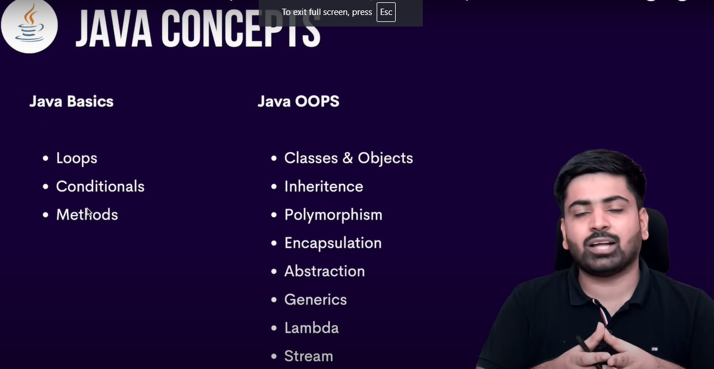
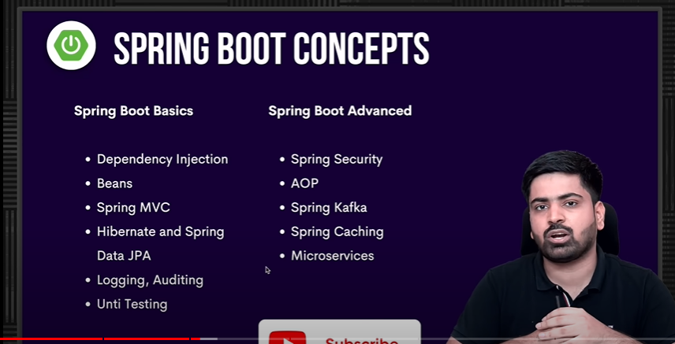
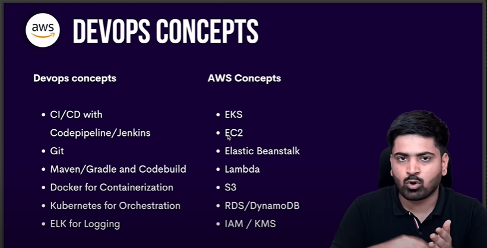
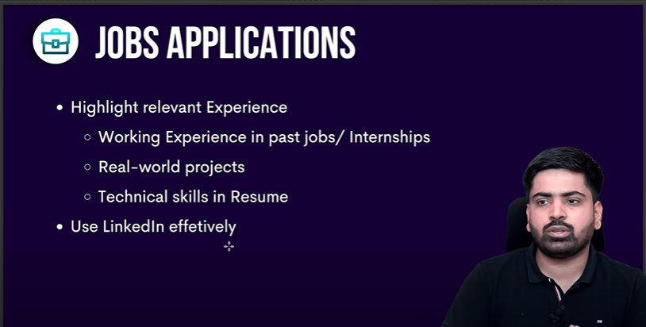
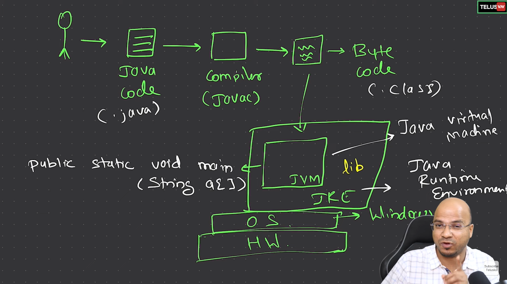
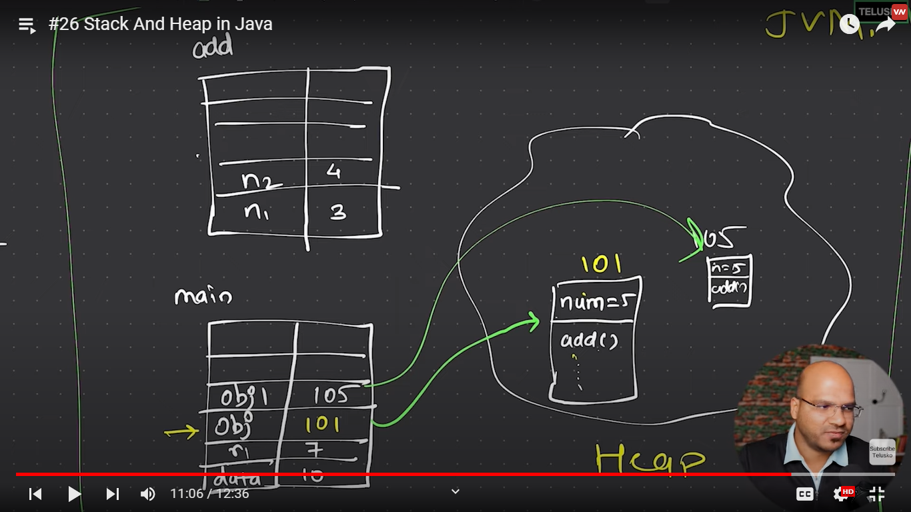
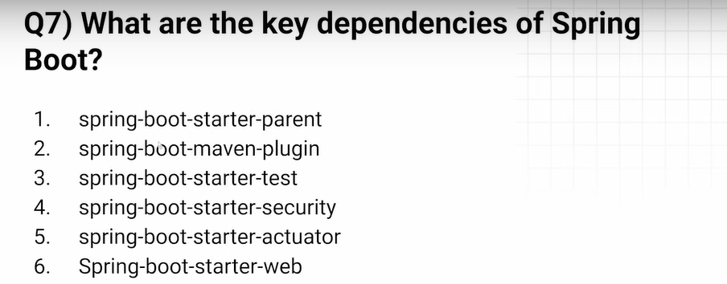

# Java important Notes

Java Topics :
https://medium.com/javarevisited/25-topics-and-resources-to-crack-java-developer-interviews-in-2021-8fbfe317513

#### Java basics:
https://www.geeksforgeeks.org/java-programming-basics/

https://youtu.be/xS-XEMepthA?si=jJPg5UuHtGQP26K4

Java Syllobous :
https://www.udemy.com/course/java-interview-questions-and-answers/?LSNPUBID=JVFxdTr9V80&ranEAID=JVFxdTr9V80&ranMID=39197&ranSiteID=JVFxdTr9V80-CZW5gLWD3LplwQZYIGDUCg&utm_medium=udemyads&utm_source=aff-campaign&couponCode=ST4MT73124
https://www.codingshuttle.com/courses/batchBundle/java-spring-boot-0-to-100_1/

Java playlist :
https://youtu.be/bm0OyhwFDuY?si=QO_SnEE_w6lwU82-

## Internal details memory management and working of Java :
##### Tutorial points blog has more info in detail below :
https://www.javatpoint.com/internal-details-of-hello-java-program

The java code is converted to byte codes by the compiler in JDK and then its 
fed to JVM ,which converts or translate byte code of the entire class at once 
by JIT to machine code of the present running machine  

The JRE is the run time environment on the top of the JVM which provides the 
files related java inbuilt methods/classes used by the code .

#### JVM subsystems
* Classloader: It is the subsystem of JVM that is used to load class files.
* Bytecode Verifier: Checks the code fragments for illegal code that can violate access rights to objects.
* Interpreter: Read bytecode stream then execute the instructions.

JIT is also used where it converts bite code to machine codes 

#### Note : 
The Java Program is machine independent as its converted to bytecode but 
JVM is machine dependent as it needs to adjust its translation as per the current
running machine language

### Youtube :
https://www.youtube.com/watch?v=NHrsLjhjmi4&list=PLsyeobzWxl7pe_IiTfNyr55kwJPWbgxB5&index=4

### Stack and heap memory :
https://chatgpt.com/c/1c17944d-b928-4a05-a787-2988e2b8e2cf

#### 1. Stack Memory : Stores method-specific values and references.
#### 2. Heap Memory : Stores objects and instance variables.

### Immutability and garbage collections chat GPT:
https://chatgpt.com/c/41e7a6fb-a96f-44a5-8834-fbce54f496fa

## Data Types 
Java is a Statically typed programing language where a variable is bound to a type 
and type should be assigned during the declaration of the variable 

In Python its dynamically typed where you can assign the type to the variable 
during run time 

### 1. Primitive datatype:
Primitive data are only single values and have no special capabilities
boolean, char, int, short, byte, long, float, and double

### 2. Non primitive datatype :
The Reference or Non primitive Data Types will contain reference 
(memory address) of variable values and has special capabilities. 
They are strings, objects, arrays, etc.

## Multi threading and async :

https://chatgpt.com/c/7b807b20-f477-4205-afc9-ab2ea6c11261

### Asynchronous programming by CompletableFuture
https://www.geeksforgeeks.org/completablefuture-in-java/

Asynchronous programming in Java is often achieved using 
the CompletableFuture class introduced in Java 8. This 
code is executed as non blocking call in a separate thread 
and result is made available when its ready

The CompletableFuture class does not block/wait for the completion of the task and 
it can execute other tasks in parallel 

Key Concepts:
1. CompletableFuture: A class that represents a future result of an 
asynchronous computation.
2. CompletionStage: An interface that represents a stage of a 
possibly asynchronous computation

#### Note:

1. RunAsync takes Runnable as input parameter and returns CompletableFuture, 
which means it does not return any result.
2. SuppyAsync takes Supplier as argument and returns the CompletableFuture 
with result value, which means it does not take any input parameters but it 
returns result as output.

# DSA:
Note :
Any datastructures which uses hash table doesnt guarantee the order 
of elements (Like Hashmap , Hashset)

## List and stream api :
https://chatgpt.com/c/b3ab0735-283b-4e7d-bb63-3f5bee489801

## Set :
https://chatgpt.com/c/824f2182-19e9-4c25-9edc-9fb881e8942c

## Queue :
https://chatgpt.com/c/824f2182-19e9-4c25-9edc-9fb881e8942c

## Strings in Java :

https://www.geeksforgeeks.org/storage-of-string-in-java/

### Diff between == and equals() in string:

https://www.interviewbit.com/java-interview-questions/#difference-between-equality-operator-and-equals-method-java

## OOP's in Java:

https://chatgpt.com/c/702fabfd-0000-44fe-beac-7232817f58b2

1. You can overload the static methods in java but you 
cant override the static methods as they belong only to the same declared class
2. From Java 8 onward you can have a non-abstract method inside the interface, 
prior to that it was not allowed as all method was implicitly public abstract.

### Method hiding in java:
If a subclass defines a static method with the same signature as 
a static method in the superclass, then the method in the subclass 
hides the one in the superclass.

### Abstract classes :
Sometimes we may come across a situation where we cannot provide
implementation to all the methods in a class. We want to leave the
implementation to a class that extends it. 

You cannot create an instance of an abstract class in Java.

## Generics
https://www.geeksforgeeks.org/generics-in-java/

### Enums:

An enum is a special "class" that represents a group of constants

### Maps and ArrayList:

https://chatgpt.com/c/6c6efd21-5811-4562-8098-d3dbb07d6464

## MongoDB:

### Tute :

https://www.w3schools.com/mongodb/mongodb_update_operators.php

### Operators:

https://www.mongodb.com/docs/manual/reference/operator/

### Aggregation:

https://www.youtube.com/watch?v=vx1C8EyTa7Y

https://www.mongodb.com/developer/languages/java/java-aggregation-pipeline/

## Spring Boot :

### Interview Questions :
https://www.youtube.com/watch?v=aW68FHrLAmA&list=PL0zysOflRCek0qgfTHPQkFezcib_yfnTl&index=1

* Its powerful a Java Frame work which allows us to easily develop and deploy 
java application 
* Spring boot allows us to easily configure and set up the application
which allows us to focus more on building the logic 
* The Spring boot allows RAD(Rapid Application Development) 

#### * It Provides these below feature of spring boot over spring 
  1. Easy to use
  2. Auto configuration
  3. Dependency Management  
  4. Embedded server
  5. Reuses the Boiler plate codes 
  6. Rapid Application Development 

### Working of spring boot 
Spring boot will start by scanning the starter dependency , it downloads the jars
of the dependency as we build and auto configure them as we run the projects

### How Spring boot starts :
Spring Boot Application Starts with main method which has SpringApplication.run() 
, which creates application context of IOC (Inversion of Controller) calls all the beans in
the classpath and initializes the context.

Once the context is initialised the run method starts the application's 
embedded server

Note : The main method has @SpringBootApplication

### @SpringBootApplication:
@SpringBootApplication is used to auto-configure, component scan and be able to
define extra configuration on their "application class". A single @SpringBootApplication annotation  
these below three features,:

* @EnableAutoConfiguration: enable Spring Boot’s auto-configuration mechanism
* @ComponentScan: enable @Component scan on the package where the application is located (see the best practices)
* @Configuration: allow to register extra beans in the context or import additional configuration classes

### Bean :
It is an instance of a class that is configured and controlled by Spring.
Beans are typically used to represent components and services within a 
Spring application. that are stored and managed by the Spring IoC 
(Inversion of Control) container.

### IOC Container : 
Beans are stored inside a particular space in JVM (Java Virtual Machine). That 
particular space is known as the IOC Container.

### Important annotations :
https://chatgpt.com/c/230d8a78-0b2c-491a-b235-01bf31e1999a

### Spring boot starters :
Starter are the collection of predefined dependencies that makes us easier to
develop a particular kind of application 

They have Dependency,Configurations and Version control to build certain feature
of spring boot  

### key Dependency are :

1. #### Spring Boot Starter Parent:
The spring-boot-starter-parent is a project starter. It provides default configurations 
for our applications. It is used internally by all dependencies , below are the properties 

* Configuration: It allows us to maintain consistency of Java Version and 
other related properties.
* Dependency Management: It controls the versions of dependencies to avoid 
conflict.
* Source encoding
* Default Java Version

### Spring CLI:
https://docs.spring.io/spring-boot/cli/using-the-cli.html

### Thymeleaf :
its a java based server side templating engine to render dynamic web pages 

### IOC (Inversion Of Control) : 
Its a mechanism where we invert the control from creating the object using new key word
to the container or framework

### DI (Dependency Injection):
Process where we implement the Inversion of control , here we are 
Connecting objects with other objects, or “injecting” objects into other objects

### Bean Life cycle :
1. Container will get started
2. Container creates the bean objets as per the request
3. Dependency created  
4. Dependency injected
5. Add Custom init() method (if needed) 
6. Add Custom utility methods (if needed)
7. Destroy when the container is closed

### Bean Factory :
Its a root Interface to access the spring bean container 

#### XML Bean Factory: 
Its the XML container which instantiate ,configure and manage the beans  

Note: We are not using the XML bean factory as its deprecated  

### Bean Factry vs Application context :
1. Bean Factory:
This is the root interface for accessing a Spring bean container. 
It is the actual container that instantiates, 
configures, and manages a number of beans

2. Application Context :
This interface is designed on top of the BeanFactory interface.
The ApplicationContext interface is the advanced container that 
enhances BeanFactory functionality in a more framework-oriented style

### Constructor injection vs Setter injection :

#### Constructor injection :
Dependencies are provided through the constructor of a class.

#### Setter injection :
Dependencies are provided through setter methods after the object is created.

1. Constructor Injection is generally preferred for mandatory dependencies and
when you want to enforce immutability and clear dependency contracts.

2. Setter Injection is useful for optional dependencies, more flexible object 
creation, and keeping constructors simple.

### @RequestBody and @ResponseBody : 
The annotations @RequestBody and @ResponseBody in Spring were used to bind 
these HTTP requests and responses. In simple words, these are the annotations
which converts JSON to your Java object and your data to JSON while sending to 
client.

Read more: https://javarevisited.blogspot.com/2022/08/how-to-use-requestbody-and-responsebody.html#ixzz8i0lEwETa

### Rest template :

https://chatgpt.com/c/d92e2a3d-5a7f-42d6-84d5-74a6fd2720e4

### Kafka implementation :

https://youtu.be/SqVfCyfCJqw?si=cOWHCWt66ZfUEOPC

In java Guids the consumer and producer configuration is done in app.prop files ,
app.yaml files and also config class
https://chatgpt.com/c/59a1c40b-0a0d-4864-bf05-cd31a36675fb
